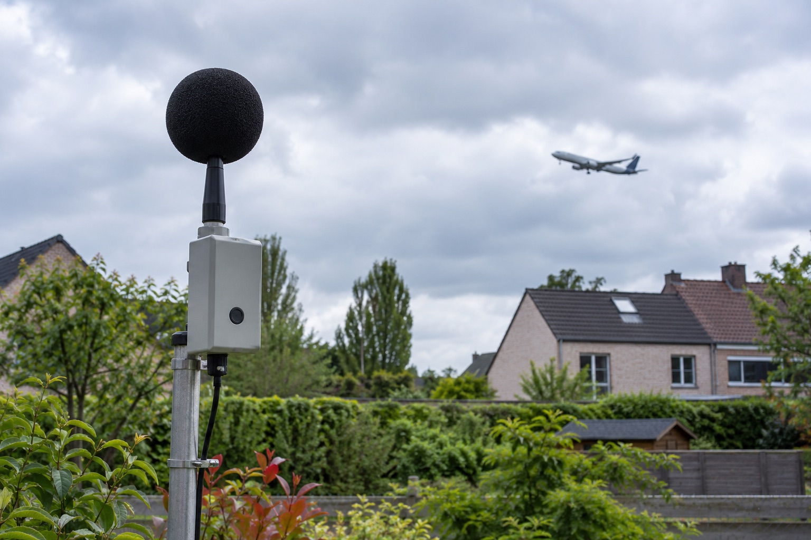

**Dit is een fictief demoartikel.** De afgebeelde installatie is illustratief en maakt geen deel uit van het huidige Vogelvrij-systeem.

De toepassing registreert openbare vliegtuigposities. Daaruit kunnen vermoedelijke naderingsbewegingen worden afgeleid, maar niet hoeveel geluid een individuele bewoner ervaart. Voor een betrouwbare uitspraak over geluidsbelasting zijn afzonderlijke, correct gekalibreerde metingen nodig.

## Twee verschillende soorten gegevens

Vliegtuigdata vertellen onder meer waar een toestel werd waargenomen, op welke hoogte het vloog en welke koers werd gemeld. Een geluidsmeter registreert daarentegen een lokaal geluidsniveau. Om beide bronnen zinvol te combineren zijn nauwkeurige tijdstippen, een gekende meetopstelling en een methode om andere geluidsbronnen uit te sluiten nodig.

Een toevallige piek kan bijvoorbeeld afkomstig zijn van verkeer, werkzaamheden of weersomstandigheden. Daarom hoort bij geluidsanalyse een duidelijk protocol en een controle van de meetkwaliteit.

## Voorzichtig communiceren

Een toekomstig artikel kan resultaten toelichten zodra er een onderbouwde meetmethode bestaat. Tot dat moment blijft de boodschap eenvoudig: de huidige cijfers gaan over gedetecteerde naderingen en zijn geen geluidsmetingen.
