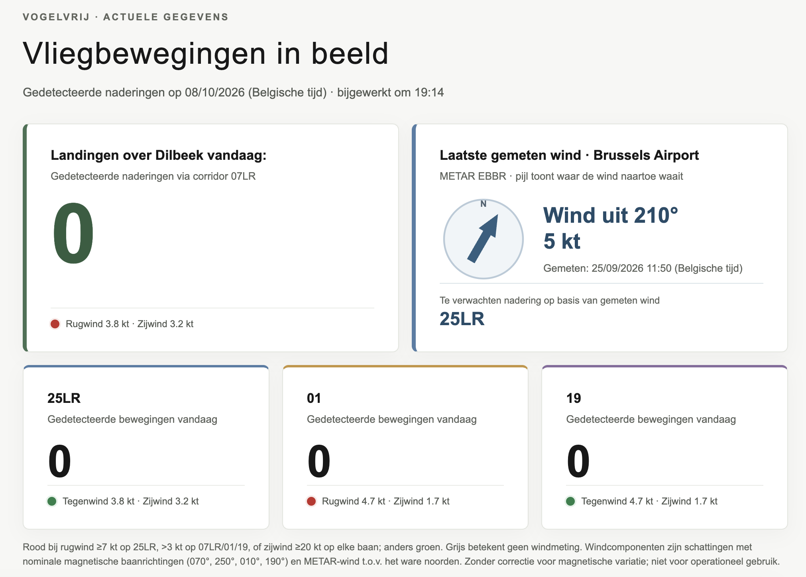

**Dit is een fictief demoartikel.** De kaarten in de gegenereerde afbeelding zijn decoratief en mogen niet als echte luchtvaartkaarten worden gebruikt.

Een routeanalyse begint met een heldere vraag. Gaat het om alle waargenomen vliegtuigen, alleen lage vluchten, of specifiek om toestellen die aan de criteria voor een naderingscorridor voldoen? Zonder die afbakening kunnen twee correcte grafieken toch een verschillend verhaal lijken te vertellen.

## Van bron naar conclusie

Een transparante analyse beschrijft minstens:

- waar de brongegevens vandaan komen;
- welke observaties worden bewaard;
- welke filters daarna worden toegepast;
- hoe ontbrekende meetmomenten worden behandeld;
- welke conclusies niet uit de gegevens mogen worden getrokken.

De huidige toepassing bewaart geschikte vliegtuigposities tot 10.000 voet. De bewegingendetector past daarna strengere voorwaarden toe voor positie, koers, snelheid en hoogte. Daardoor is het normaal dat de kaart meer vliegtuigen toont dan de bewegingentelling.

## Controleerbare publicatie

Bij een echt nieuwsbericht horen verwijzingen naar openbare bronnen en een vermelding van de gebruikte periode. Wanneer definities of detectorregels later veranderen, moet ook duidelijk zijn welke versie voor een analyse werd gebruikt.

Deze nieuwsmodule bewaart zelf geen analysecijfers in Markdown. Ze publiceert redactionele tekst en afbeeldingen; de actuele tellingen blijven afkomstig uit de database en de bestaande webfunctionaliteit.

# Voorbeeld

Hieronder enkele voorbeelden van de vluchtinformatie die je kan zien:

